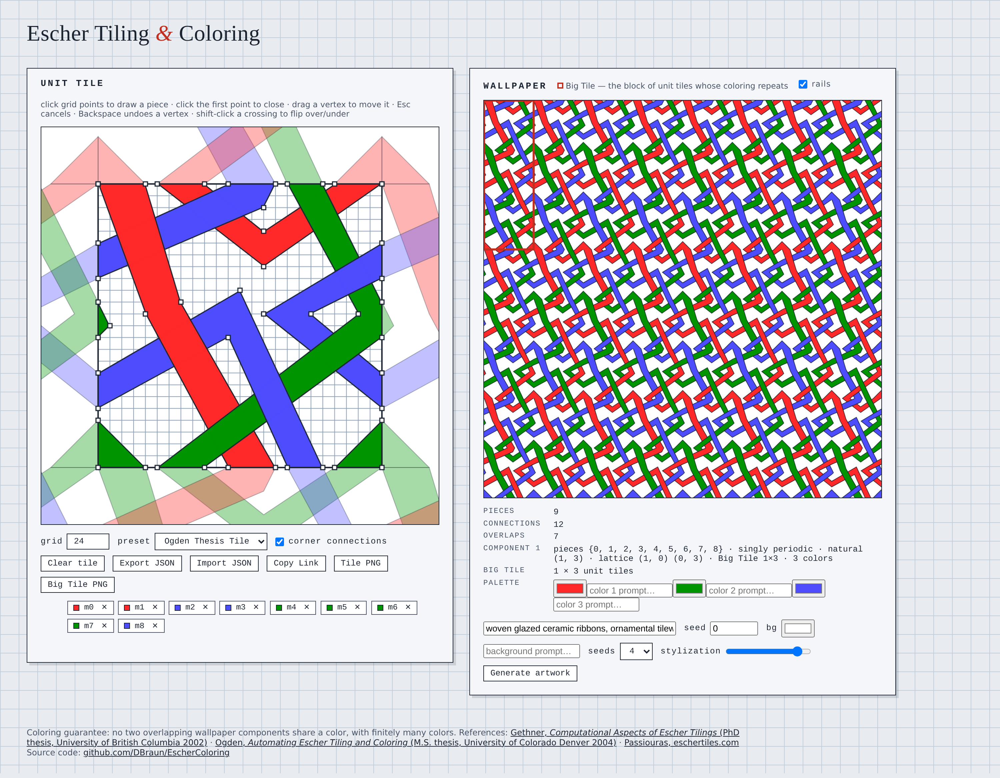

# EscherColoring

Interactive demo of automatic Escher tiling and coloring.

Draw motif pieces on a unit tile; the app digitizes the boundary constraints
(where pieces touch or wrap across the tile edges), builds the period graph,
and computes a wallpaper coloring with the guarantee that **no two
overlapping wallpaper components (ribbons) receive the same color**, using
finitely many colors.



## Running the demo

```bash
python3 -m venv .venv
.venv/bin/pip install numpy shapely fastapi "uvicorn[standard]" pytest
.venv/bin/uvicorn server.main:app --port 8123
# open http://127.0.0.1:8123/
```

Tests:

```bash
.venv/bin/python -m pytest tests/
```

## How it works

The algorithm is Ellen Gethner's; the implementation follows the blueprint in
Stephen C. Ogden's M.S. thesis and reproduces its worked example exactly
(`tests/test_thesis_example.py`).  Pipeline, with thesis sections in
parentheses:

1. **Digitize** (2.2–2.4): motif pieces are polygons with vertices on a grid
   in the unit square.  A *connection* `(i, j, (dx, dy))` is recorded when
   piece `j` translated by one tile unit `(dx, dy)` touches piece `i`; an
   *overlap* `(i, j)` when two pieces of the same tile share a point.
   Diagonal (corner) adjacency is Ogden's convention and can be toggled off
   for the Gethner–Kirkpatrick–Pippenger (FUN 2012) convention.
2. **Period graph → generating sets** (2.5–2.7): a spanning forest assigns
   every piece a position vector relative to its component's origin piece.
3. **Natural periods** (2.8): each removed (cycle-closing) edge yields a
   ghost-node difference; the Hermite-normal-form basis of these differences
   is the natural-period lattice — the translations mapping a wallpaper
   component onto itself.  Zero, one, or two periods mean trivially, singly,
   or doubly periodic.
4. **Forbidden vectors** (2.10–2.11): overlaps between pieces of the same
   component that belong to *different* component copies give the
   translations under which copies collide, reduced modulo the natural
   lattice.
5. **Collision-free vectors** (2.12): the natural lattice is completed to a
   full-rank *period lattice* containing no forbidden vector (Definition 9 of
   the FUN 2012 paper — checked for the whole candidate lattice, which is
   stricter than the thesis pseudocode).  Among valid completions in the
   smallest sufficient search ring, one minimizing the determinant (= number
   of colors) is chosen, a heuristic answer to Open Question 4 of FUN 2012.
6. **Big Tile and colors** (2.13–2.16): the lattice determinant is the number
   of colors; coset representatives of `Z²/L` are the color vectors; the Big
   Tile (the FUN 2012 "prototile") is the smallest rectangle of unit tiles
   whose coloring repeats.  Components get disjoint palettes and their Big
   Tiles merge by least common multiples.

Correctness is checked in `tests/conftest.py` by brute force on a wallpaper
window: connected piece instances (union-find ground truth) must share a
color, and overlapping instances of distinct component copies must not.

## Layout

- `escher/` — the algorithm: `lattice.py` (exact integer HNF/coset math),
  `periods.py` (period graph), `forbidden.py` (forbidden vectors and
  collision-free completion), `bigtile.py` (Big Tile and color assignment),
  `coloring.py` (pipeline), `tile.py` (polygon digitizer, shapely).
- `server/` — FastAPI backend (`POST /api/color`).
- `web/` — canvas front end: unit tile editor with ghost copies of the 8
  neighbor tiles (the boundary constraints made visible), live wallpaper
  rendering with the Big Tile registration outline, presets, JSON
  import/export.
- `docs/ROADMAP.md` — planned text-to-image stage.

## Design rule worth knowing

Ribbon crossings must lie in the tile **interior**.  If an overlap region
touches a tile edge, the two ribbons also share a boundary point across
adjacent tiles, which makes them *connected* (one component) instead of
*overlapping* (two components) — mathematically consistent, but usually not
what the designer intended.  This is why Escher's own weaves cross away from
the tile edges.

## References

- E. Gethner, *Computational Aspects of Escher Tilings*, PhD thesis,
  University of British Columbia, 2002. <https://dx.doi.org/10.14288/1.0051682>
- S. C. Ogden, *Automating Escher Tiling and Coloring: An Implementation*,
  M.S. thesis, University of Colorado Denver, 2004.
  <https://digital.auraria.edu/works/publication-dissertation/ds616-sey88>
- E. Gethner, D. G. Kirkpatrick, N. J. Pippenger, *M.C. Escher Wrap Artist:
  Aesthetic Coloring of Ribbon Patterns*, FUN 2012, LNCS 7288, pp. 198–209.
- S. Passiouras, *Escher Tiles*, <https://www.eschertiles.com/> — Escher's
  original combinatorial patterns.
- D. Schattschneider, *M.C. Escher: Visions of Symmetry*, 2nd ed., 2004.
- D. Braun, *Escher Tiles Coloring Algorithm, TouchDesigner*, 2018.
  <https://vimeo.com/277855389>

## License

MIT — see [LICENSE](LICENSE).
